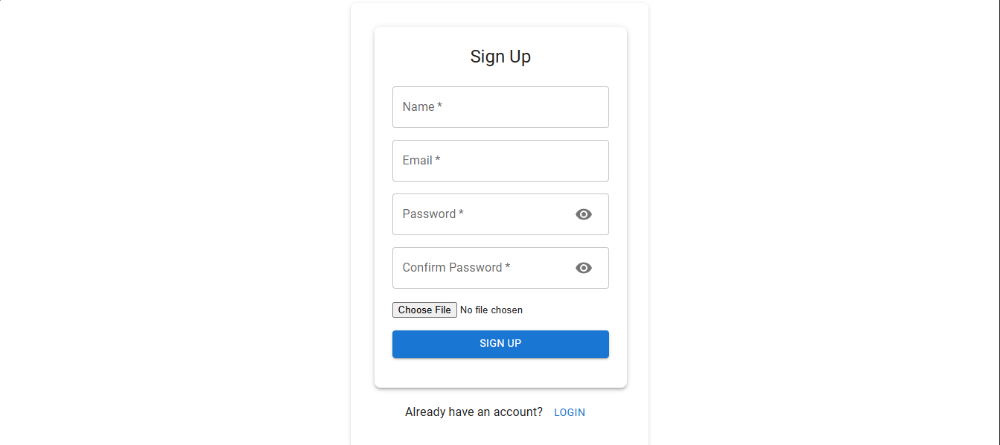
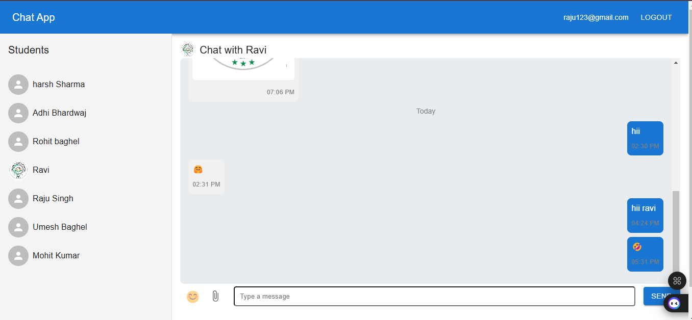
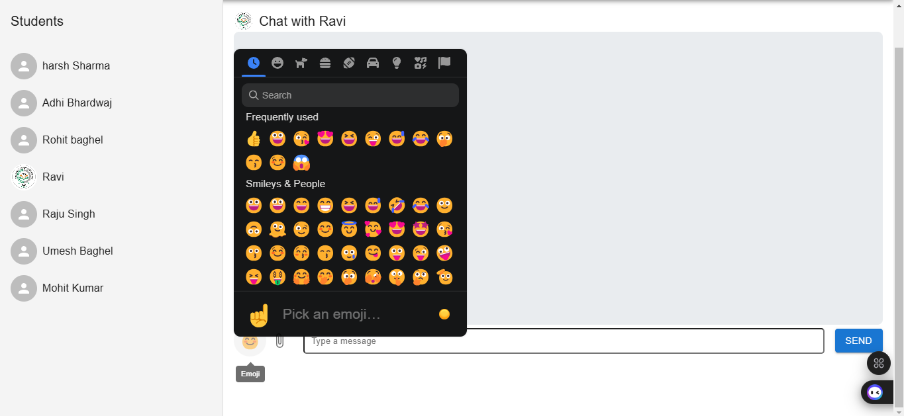
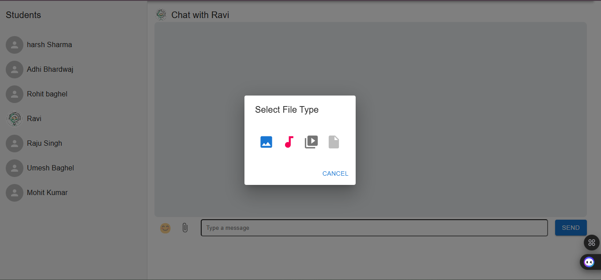

# 📩 Chat App

Welcome to **Chat App**! 🚀 This application allows users to chat privately with each other, send messages, audio, video, documents, and images. Users can create an account using their email and enjoy seamless communication.

---

## 📸 Screenshots

### 🔐 Login / Signup Page



### 💬 Private Chat




---

## ✨ Features

✅ **Secure Authentication**: Sign up & login using your email.  
✅ **Private Messaging**: Chat one-on-one securely.  
✅ **Multimedia Support**: Send **text messages, audio, video, documents, and images**.  
✅ **Real-time Communication**: Messages appear instantly using **Firebase & WebRTC**.  
✅ **Modern UI**: Interactive and user-friendly design.  

---

## 🚀 Getting Started

### 🛠 Installation

1️⃣ Clone this repository:
```bash
 git clone https://github.com/Harshbh7/Chat-App-Firebase.git
```

2️⃣ Navigate to the project folder:
```bash
 cd Chat-App-Firebase
```

3️⃣ Install dependencies:
```bash
 npm install
```

4️⃣ Create a `.env` file in the root directory and add your Firebase & Cloudinary credentials:
```
VITE_FIREBASE_API_KEY=your_api_key
VITE_FIREBASE_AUTH_DOMAIN=your_auth_domain
VITE_FIREBASE_PROJECT_ID=your_project_id
VITE_FIREBASE_STORAGE_BUCKET=your_storage_bucket
VITE_FIREBASE_MESSAGING_SENDER_ID=your_messaging_sender_id
VITE_FIREBASE_APP_ID=your_app_id
VITE_FIREBASE_DATABASE_URL=your_database_url

VITE_CLOUDINARY_CLOUD_NAME=your_cloud_name
VITE_CLOUDINARY_UPLOAD_PRESET=your_upload_preset
```

5️⃣ Start the application:
```bash
 npm run dev
```

---

## 📌 Tech Stack
- **Frontend**: React, Vite, MUI, SwalAlert2
- **Backend**: Firebase (Auth, Firestore, Realtime Database)
- **File Storage**: Cloudinary
- **Real-time Chat**: Socket.IO

---

## 🎨 UI Preview

📌 **Modern UI with smooth interactions** 🎨  
📌 **Responsive Design - Works on all devices** 📱💻  

---

## 🛠 Future Enhancements
- **Private/One to One Chat** 💬
- **Reactions & Emojis** 😍👍

---

## 💡 Contributing
We welcome contributions! Feel free to open issues or submit pull requests. 🤝

---

## 📜 License
This project is licensed under the ** License**.

---

## 📞 Contact
For any issues or feedback, reach out:
📧 **Email**: harshbh20102@gmail.com  
🌍 **Website**: [your-website.com](https://your-website.com)  
🐙 **GitHub**: [your-github](https://github.com/harshbh7)

Happy Coding! 🚀

